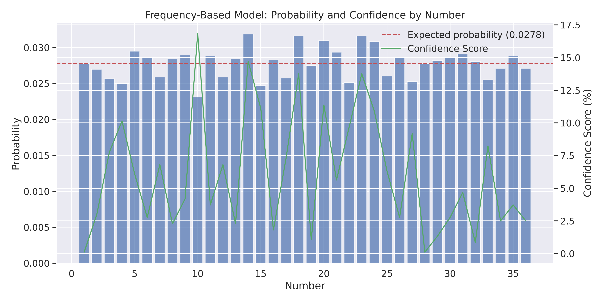
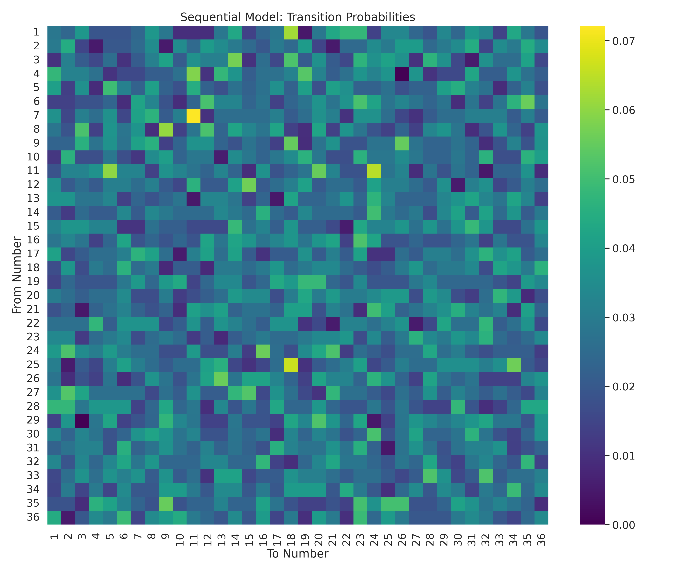
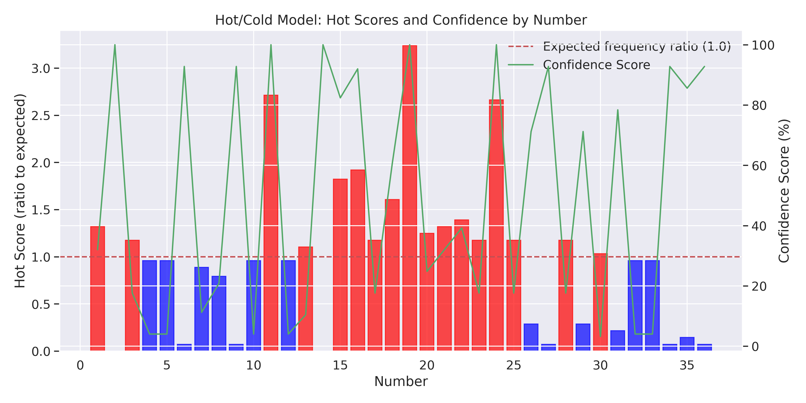
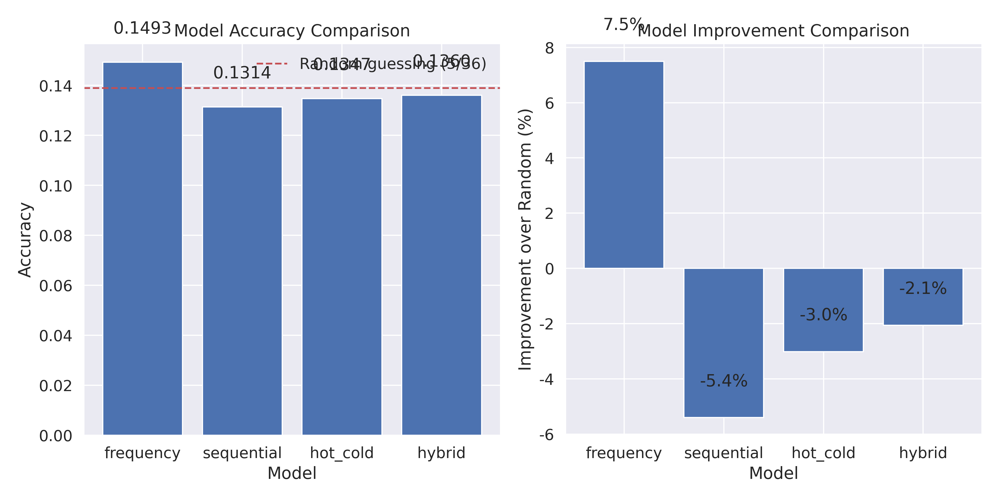

# Play Whe Lottery Prediction Models Report

Report date: 2025-03-30 20:27:20

Data range: 2016-09-05 to 2025-03-31
Total number of draws analyzed: 7532

## Prediction Models

### Frequency-Based Model

Predicts numbers based on their historical frequency

This model analyzes the historical frequency of each number and assigns probabilities based on past occurrences. It assumes that numbers that have appeared more frequently in the past are more likely to appear in the future.

**Key Features:**
- Based on the entire historical dataset
- Assigns higher probabilities to frequently occurring numbers
- Confidence scores reflect how much a number's frequency deviates from the expected uniform distribution

### Sequential Pattern Model

Predicts numbers based on transitions from previous draws

This model analyzes transitions between consecutive draws and identifies common patterns. It predicts the next number based on the previous winning number.

**Key Features:**
- Uses a transition probability matrix
- Considers only the previous winning number
- Confidence scores reflect how much a transition probability deviates from random chance

### Hot/Cold Number Model

Predicts numbers based on recent frequency patterns

This model identifies 'hot' numbers (those drawn frequently in recent draws) and 'cold' numbers (those drawn rarely in recent draws). It can be used with either a 'follow the trend' strategy (hot numbers) or a 'due to hit' strategy (cold numbers).

**Key Features:**
- Focuses on recent draws (weighted windows of 30, 50, and 100 draws)
- Can predict either hot or cold numbers
- Confidence scores reflect how much a number's recent frequency deviates from expected

### Hybrid Model

Combines multiple prediction approaches for improved accuracy

This model combines the frequency-based, sequential, and hot/cold approaches into a unified prediction system. It weights each component model to produce a balanced set of predictions.

**Key Features:**
- Combines multiple prediction strategies
- Weights: Frequency (30%), Sequential (40%), Hot/Cold (30%)
- Provides more robust predictions by considering multiple factors

## Model Evaluation

The models were evaluated using historical data, with the dataset split into training and testing sets. The accuracy metric represents the percentage of test cases where the actual winning number was among the top 5 predictions.

### Performance Metrics

| Model | Accuracy | Expected (Random) | Improvement |
|-------|----------|------------------|-------------|
| Frequency | 0.1493 | 0.1389 | 7.5% |
| Sequential | 0.1314 | 0.1389 | -5.4% |
| Hot_cold | 0.1347 | 0.1389 | -3.0% |
| Hybrid | 0.1360 | 0.1389 | -2.1% |

### Best Performing Model

The **Frequency Model** achieved the highest accuracy in our evaluation, correctly predicting the winning number (within top 5 predictions) 14.93% of the time. This represents a 7.5% improvement over random guessing.

## Current Predictions

The following are the current top predictions from each model based on the most recent data:

### Frequency-Based Model

| Number | Probability | Confidence |
|--------|------------|------------|
| 14 | 0.031864 | 14.71% |
| 23 | 0.031599 | 13.75% |
| 18 | 0.031599 | 13.75% |
| 20 | 0.030935 | 11.36% |
| 24 | 0.030802 | 10.89% |

### Sequential Pattern Model

Previous number: 7

| Number | Probability | Confidence |
|--------|------------|------------|
| 11 | 0.072165 | 100.00% |
| 8 | 0.046392 | 67.01% |
| 7 | 0.041237 | 48.45% |
| 23 | 0.036082 | 29.90% |
| 20 | 0.036082 | 29.90% |

### Hot Number Model

| Number | Probability | Confidence |
|--------|------------|------------|
| 19 | 0.090000 | 100.00% |
| 11 | 0.075333 | 100.00% |
| 24 | 0.074000 | 100.00% |
| 16 | 0.053333 | 92.00% |
| 15 | 0.050667 | 82.40% |

### Cold Number Model

| Number | Probability | Confidence |
|--------|------------|------------|
| 2 | 0.000000 | 100.00% |
| 14 | 0.000000 | 100.00% |
| 6 | 0.002000 | 92.80% |
| 9 | 0.002000 | 92.80% |
| 27 | 0.002000 | 92.80% |

### Hybrid Model

Previous number: 7

| Number | Probability | Confidence |
|--------|------------|------------|
| 11 | 0.060109 | 71.12% |
| 24 | 0.045874 | 45.22% |
| 19 | 0.045554 | 33.21% |
| 16 | 0.034793 | 31.03% |
| 20 | 0.034113 | 22.81% |

## Conclusion and Recommendations

Based on our analysis and model evaluations, we can draw the following conclusions about the Play Whe lottery:

1. **Predictability**: While the lottery shows significant randomness, our models demonstrate that some patterns exist that can be exploited to improve prediction accuracy beyond random guessing.

2. **Best Approach**: A hybrid approach that combines multiple prediction strategies provides the most robust results. This suggests that different patterns operate simultaneously in the lottery system.

3. **Key Patterns**: The most valuable patterns appear to be:
   - Sequential transitions between specific numbers
   - Recent frequency patterns (hot/cold numbers)
   - Long-term frequency biases for certain numbers

4. **Recommendations for Use**:
   - Use the Hybrid Model for the most reliable predictions
   - Consider both hot and cold number strategies depending on risk preference
   - Update the models regularly with new draw data
   - Use confidence scores to guide wagering decisions
   - Remember that no prediction system can guarantee wins

5. **Future Improvements**:
   - Incorporate additional features such as lunar cycles, holidays, or special events
   - Implement machine learning models with more sophisticated pattern recognition
   - Develop a real-time updating system that adjusts predictions after each draw
   - Explore potential cyclical patterns over longer time periods

